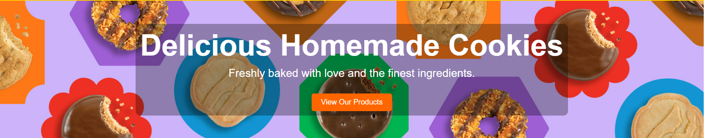
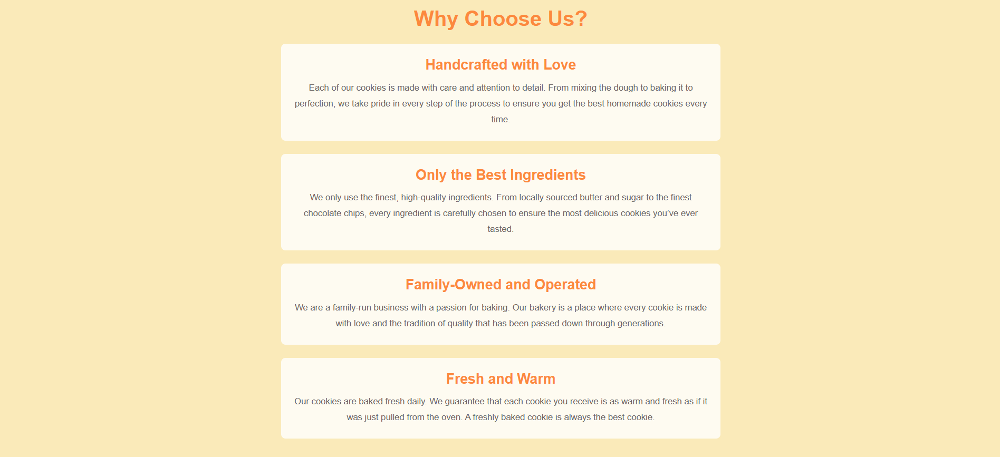
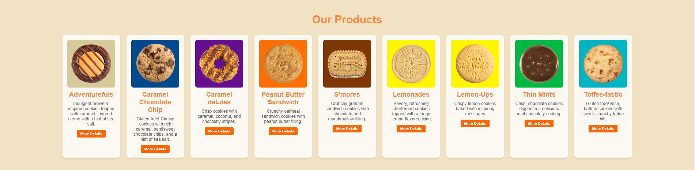
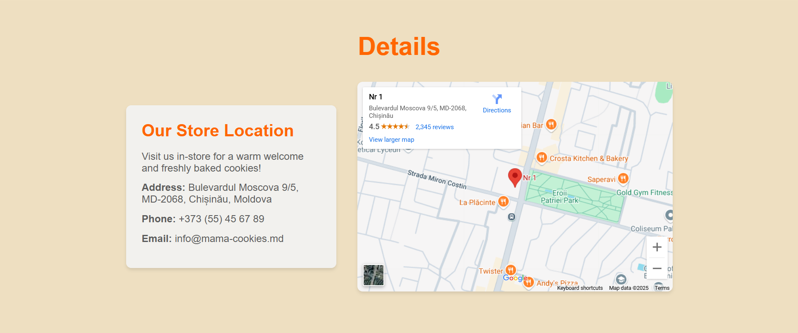

# Mama's Cookies Landing Page

Welcome to the **Mama's Cookies Landing Page** repository! This project is a responsive and modern landing page designed for a a family-run store specializing in homemade cookies. The page includes multiple sections that showcase the business, its products, and a contacts section for users to interact with it.

## Features
- **Hero Section**: The hero section provides an introductory message: "Delicious Homemade Cookies." A call-to-action button (labeled "View Our Products") directs users to the Products section.
- **Why Choose Us Section**: This section explains why customers should choose Mama's Cookies over other cookie sellers.
It highlights the bakery's unique qualities, such as using the finest ingredients and baking with love.
- **Products Section**: Displays products offered by the store. Each product is displayed with a product image, a short description, and a "More Details" button.
- **Details Section**: The Details section provides additional information about how customers can interact with the store.
It includes a contact number and an embedded Google Map to show the location of the store.

## Screenshots
Here are some screenshots of the landing page:

### Hero Section

### Why Choose Us Section

### Products Section

### Details Section

